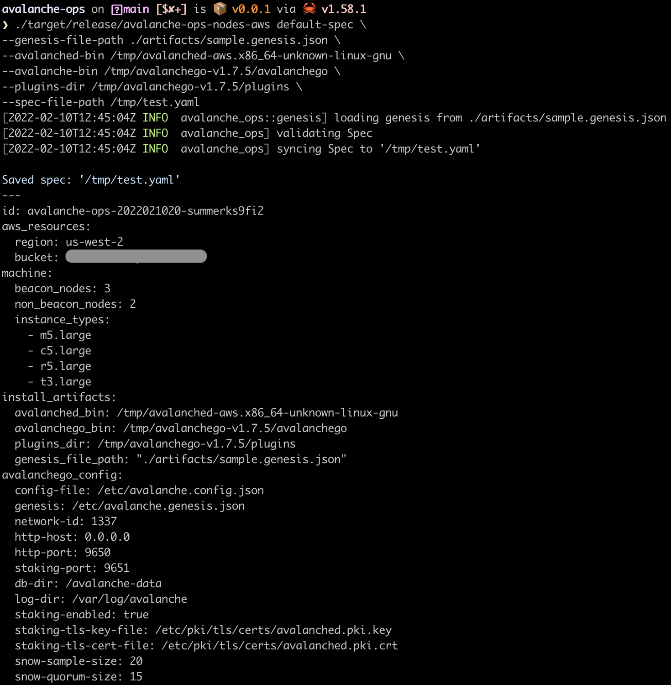
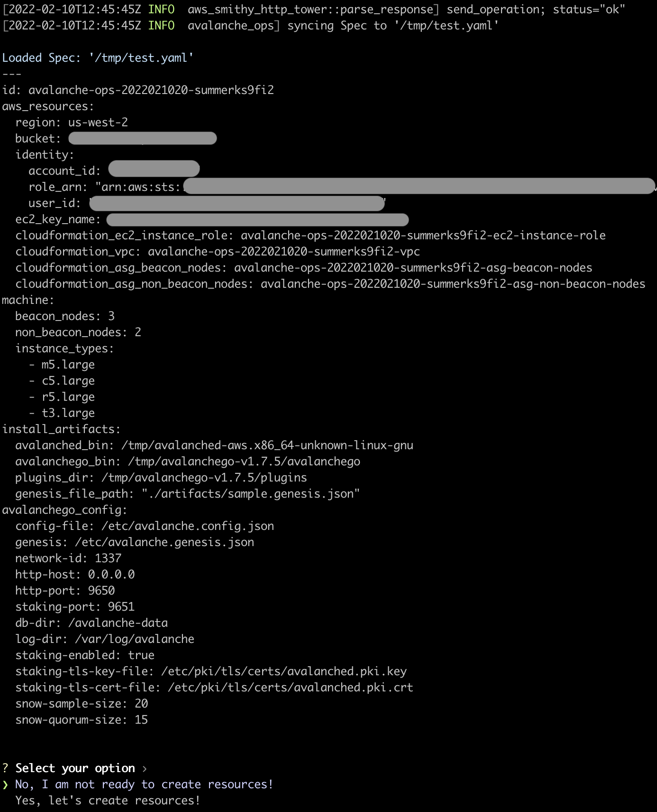
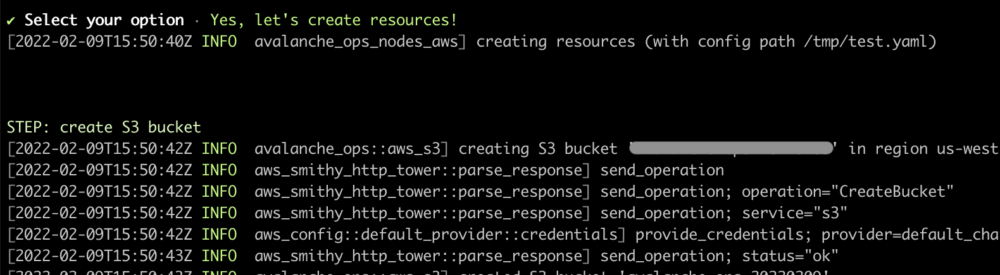
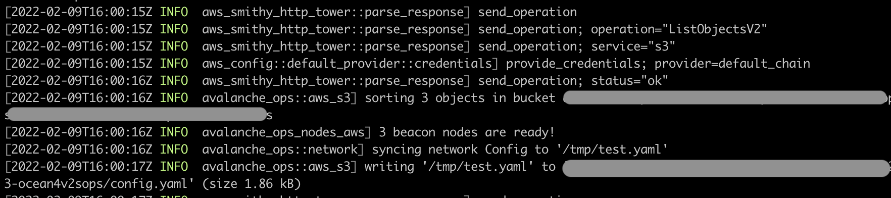
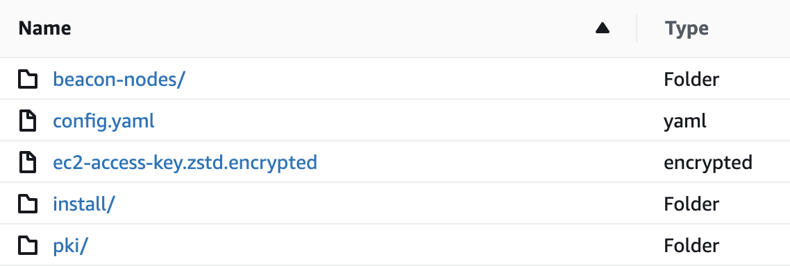
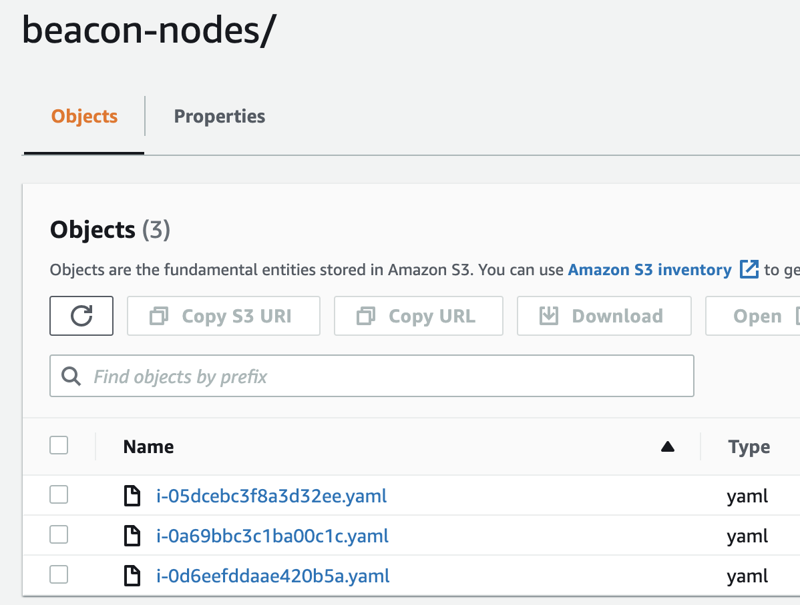
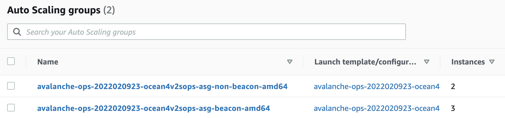
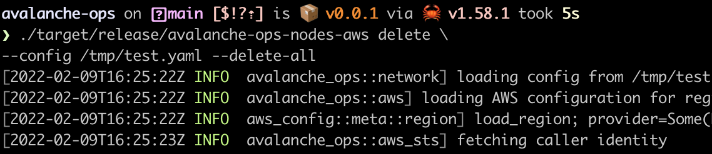
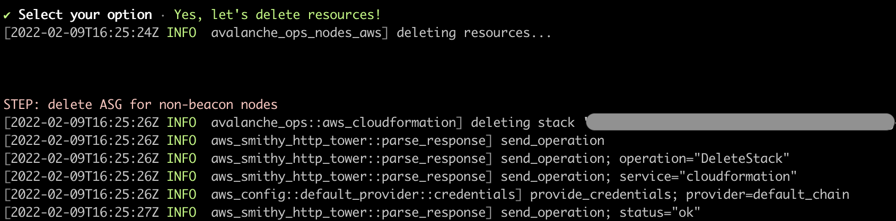

<br>

 

# Avalanche Ops

`avalanche-ops` is an operation toolkit for Avalanche nodes:
- 🦀 Written in Rust
- 🏗️ Fully automates VM (or physical machine) provisioning
- 🍏 Fully automates node installation
- 🚜 Fully automates node operations
- 💻 Fully automates test network setups
- 🛡️ Securely encrypt all artifacts in case of backups

`avalanche-ops` is:
- 🚫 NOT a replacement of [`avalanchego`](https://github.com/ava-labs/avalanchego)
- 🚫 NOT implementing any client-side load generation (to be done in Avalanche client/node projects)
- 🚫 NOT implementing any Avalanche-specific test cases (focus on infrastructure setups)
- 🚫 NOT using Kubernetes, prefers physical machines (or cloud VMs)
- 🚫 **NOT production ready** (under heavy development, only used for testing)

## Installation

```bash
# to build manually
./scripts/build.release.sh

# TODO: not working
# ./scripts/build.cross.sh
```

```bash
# to download from the github release page
# https://github.com/ava-labs/avalanche-ops/releases/tag/tip
curl -L \
https://github.com/ava-labs/avalanche-ops/releases/download/tip/avalanched-aws.x86_64-unknown-linux-gnu \
-o /tmp/avalanched-aws.x86_64-unknown-linux-gnu
```

It requires Avalanche node software in order to bootstrap the remote machines:

```bash
# https://github.com/ava-labs/avalanchego/releases
VERSION=1.7.5
DOWNLOAD_URL=https://github.com/ava-labs/avalanchego/releases/download/
rm -rf /tmp/avalanchego.tar.gz /tmp/avalanchego-v${VERSION}
curl -L ${DOWNLOAD_URL}/v${VERSION}/avalanchego-linux-amd64-v${VERSION}.tar.gz -o /tmp/avalanchego.tar.gz
tar xzvf /tmp/avalanchego.tar.gz -C /tmp
find /tmp/avalanchego-v${VERSION}
```

## Workflow

`avalanche-ops` is the client (or control plane) that provisions a set of remote machines based on user-provided configuration. `avalanched` is an agent (or daemon) that runs on each remote machine to create and install Avalanche-specific resources (e.g., TLS certificate generation, beacon-node discovery). `avalanche-ops` first provides Avalanche genesis file and executable binaries to run in remote machines. Then control remote machines to download and set up such user-provided artifacts. It requires two groups of machines: (1) beacon node (only required for custom network), and (2) non-beacon node. Whether the node type is beacon or not, during bootstrap, `avalanched` auto-generates the TLS certificates and stores encrypted version in a shared remote storage. If the node type is beacon, the `avalanche` publishes `BeaconNode` information in YAML to a shared remote storage, which is used for service discovery mechanism for non-beacon nodes.

## `avalanche-ops` on AWS

A single command to create a new Avalanche node from scratch and join any network of choice (e.g., test, fuji, main) or a custom Avalanche network with multiple nodes. Provisions all AWS resources required to run a node or network with recommended setups (configurable):

```bash
avalanche-ops-nodes-aws default-spec \
--avalanched-bin /tmp/avalanched-aws.x86_64-unknown-linux-gnu \
--avalanche-bin /tmp/avalanchego-v1.7.5/avalanchego \
--plugins-dir /tmp/avalanchego-v1.7.5/plugins \
--genesis-file-path artifacts/sample.genesis.json \
--spec-file-path /tmp/test.yaml \
```

```bash
# make sure you have access to your AWS account
ROLE_ARN=$(aws sts get-caller-identity --query Arn --output text);
echo $ROLE_ARN

ACCOUNT_ID=$(aws sts get-caller-identity --query Account --output text);
echo ${ACCOUNT_ID}
```

```bash
# edit "/tmp/test.yaml" if needed
# to create resources
avalanche-ops-nodes-aws apply \
--spec-file-path /tmp/test.yaml
```

```bash
# to clean up resources
# specify "--delete-all" to delete auto-created S3 bucket
# otherwise, S3 bucket is not deleted
avalanche-ops-nodes-aws delete \
--spec-file-path /tmp/test.yaml
```

Avalanche node daemon that provisions and manages the software on the remote machine (e.g., generate certs, encrypt, upload to S3):

```bash
avalanched-aws
```

### Demo: custom network on AWS

Write the configuration file with some default values:



Then apply the configuration:





Wait for beacon nodes to be ready:



Check your S3 bucket for generated artifacts (all keys are encrypted using KMS):



Check the beacon nodes and make sure you can access via public IPv4 address:



```yaml
---
ip: 34.209.4.8
id: NodeID-BD9XC2pLr1ADLuDSmPx6Di2fYFHpSrJTt
```

```bash
curl -L http://34.209.4.8:9650/ext/metrics
```

Now, check non-beacon nodes created in a separate Auto Scaling Groups:




To shut down the network, run `avalanche-ops-nodes-aws delete` command:





## Roadmap

- Genesis file generator with pre-funded wallets
- Failure injection testing
- Stress testing
- Log collection
- Metrics collection
- Support custom VMs
- Support ARM
- Support Raspberry Pi
- Support key rotation
- Integrate with DNS for easier service discovery

## Other projects

- [`avalanche-network-runner`](https://github.com/ava-labs/avalanche-network-runner) to run a local network (with Kubernetes)
- [`avalanchego-operator`](https://github.com/ava-labs/avalanchego-operator) to run a Kubernetes operator
