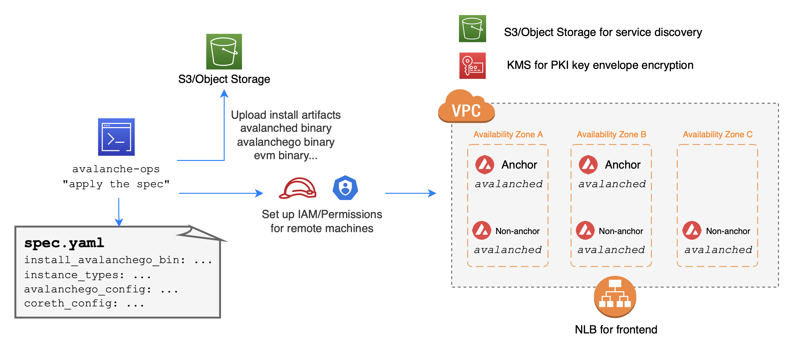

<br>


# Avalanche Ops

A **single command to launch Avalanche nodes from scratch that joins any network of choice (e.g., test, fuji, main) or creates a custom Avalanche network**. Provisions all resources required to run a node or network with recommended setups (configurable).

Distributed systems are full of subtle edge cases. The fact that such event or bug may only emerge under special circumstances warrants exhaustive test coverage beyond simple unit testing. Furthermore, the lack of tests slows down software release process, let alone long-term architectural changes.

`avalanche-ops` aims to find vulnerabilities in Avalanche protocol by intentionally causing failures, and provides a reliable and faster way to validate the fix. In addition, `avalanche-ops` implements some basic principles and best practices for operating Avalanche node in production.

`avalanche-ops` is an operation toolkit for Avalanche nodes:
- 🦀 Written in Rust
- ✅ Optimized for ephemeral network create/delete
- ✅ Fully automates VM (or physical machine) provisioning
- ✅ Fully automates node installation and operations
- ✅ Fully automates custom network setups
- ✅ Fully automates custom VM (subnet) setups
- 🔥 Simulates routine failure conditions (slow network)
- 📨 Securely encrypt all artifacts in case of backups

`avalanche-ops` is:
- 🚫 NOT a replacement of [`avalanchego`](https://github.com/ava-labs/avalanchego)
- 🚫 NOT implementing any client-side load generation (to be done in Avalanche client/node projects)
- 🚫 NOT implementing any Avalanche-specific test cases (focus on infrastructure setups)
- 🚫 NOT using Kubernetes, prefers physical machines (or cloud VMs)
- 🚫 **NOT production ready yet** (under heavy development)

*Why not production ready?* (1) The way we set up AutoScaling group (AWS ASG) for anchor nodes may not work for long-running network, where nodes get replaced by ASG for EC2 health check failures (e.g., degraded network, EC2 hardwares). We need to set up proper health checks against Avalanche health API. (2) We need to support static IP (thus static node ID) and static certificates by implementing another layer of control plane. (3) We need to track more avalanche layer metrics natively via CloudWatch or DataDog. Contributions are welcome!

## Workflow

**`avalanche-ops`** is the client (or "control plane") that runs on the operator's host machine or test runner, which provisions a set of remote machines based on user-provided configuration. **`avalanched`** is an agent (or daemon) that runs on every remote machine, which creates and installs Avalanche-specific resources (e.g., TLS certificate generation, anchor-node discovery, write avalanche node service file).

To set up a custom network, provide **`avalanche-ops`** with executable binaries to run in remote machines. Which then generates a genesis file with pre-funded keys and provisions remote machines to install the user-provided artifacts. A custom network requires two groups of machines: (1) anchor node (beacon node, only required for custom network), and (2) non-anchor node. During the bootstrap phase, regardless of its node kind, **`avalanched`** auto-generates TLS certificates and stores them encrypted in the remote storage. Beacon nodes publish its information in YAML to the shared remote storage, and non-anchor nodes list the storage to discover anchor nodes.



## `avalanche-ops` and `avalanched` on AWS

See [`recipes-aws.md`](./recipes-aws.md) and [`example-aws.md`](./example-aws.md).

## Installation

```bash
# to build manually
./scripts/build.release.sh
```

```bash
# to download from the github release page
# https://github.com/ava-labs/avalanche-ops/releases/tag/latest
# or visit https://github.com/ava-labs/avalanche-ops/releases
curl -L \
https://github.com/ava-labs/avalanche-ops/releases/download/latest/avalanched-aws.x86_64-unknown-linux-gnu \
-o ${HOME}/avalanched-aws.x86_64-unknown-linux-gnu
```

## TODOs

Contributions are welcome!

- Support automatic subnet/VM setup
- Support more static IP (by pre-allocating IPv6)
- Support more static node ID (by reusing generated certs)
- Support mainnet fork
- Failure injection testing
- Stress testing
- Avalanche metrics collection
- Better Avalanche node health checks
- Support ARM
- Support Raspberry Pi
- Support key rotation

## Other projects

- [`avalanche-network-runner`](https://github.com/ava-labs/avalanche-network-runner) to run a local network (with Kubernetes)
- [`avalanchego-operator`](https://github.com/ava-labs/avalanchego-operator) to run a Kubernetes operator
