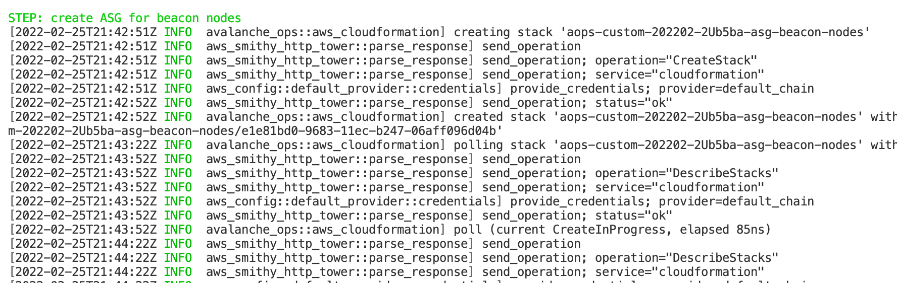
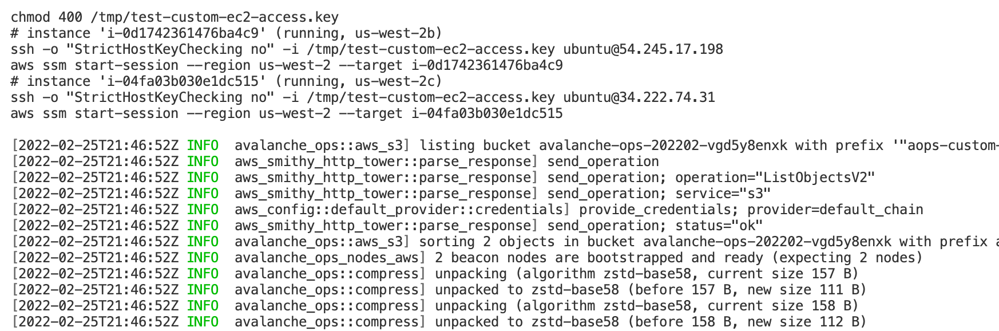
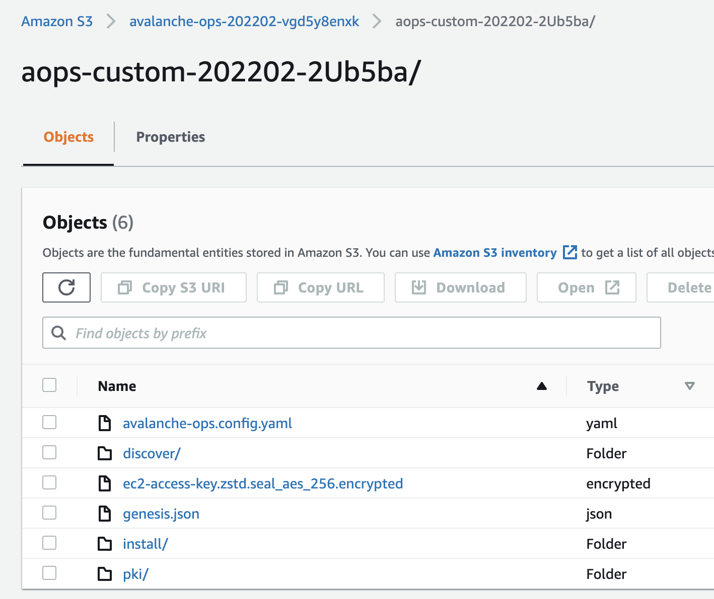
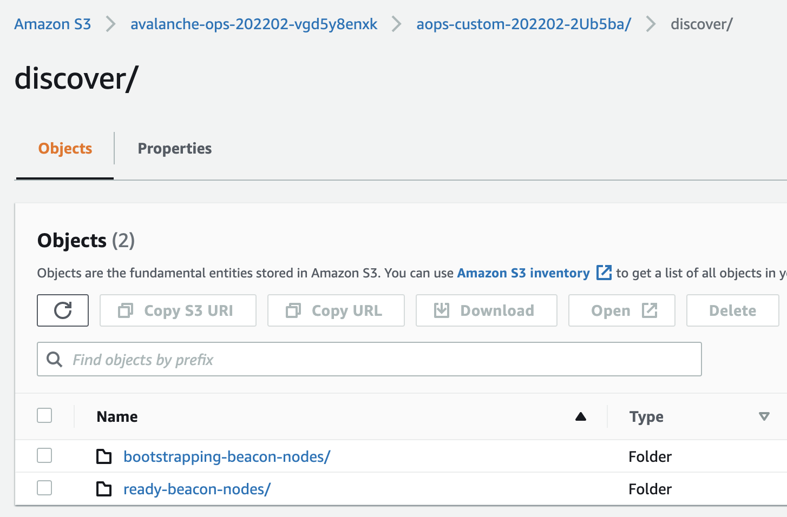
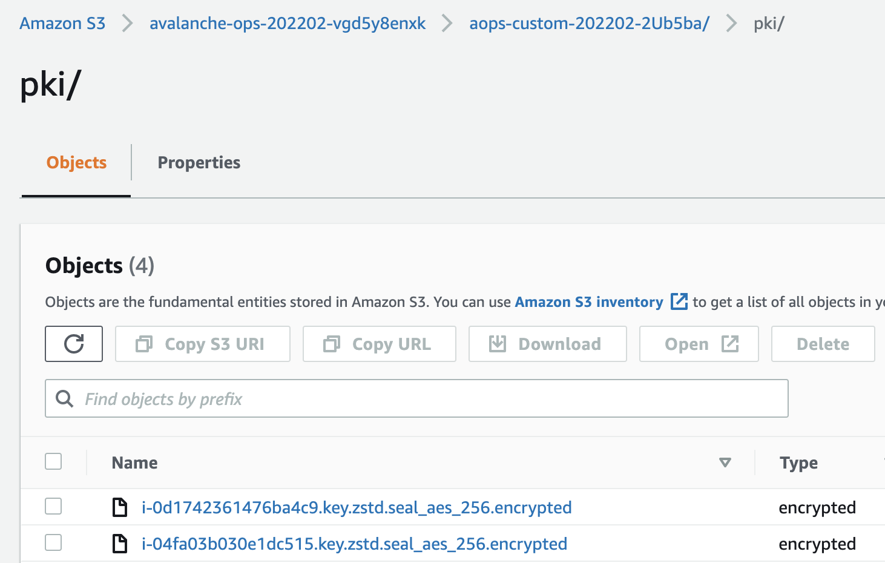
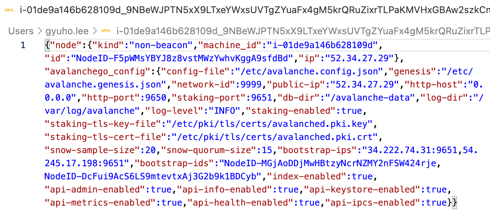
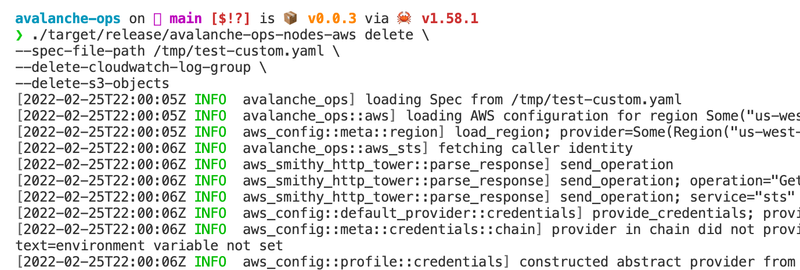

<br>

 

# Avalanche Ops

`avalanche-ops` is an operation toolkit for Avalanche nodes:
- 🦀 Written in Rust
- ✅ Fully automates VM (or physical machine) provisioning
- ✅ Fully automates node installation and operations
- ✅ Fully automates custom network setups
- ✅ Fully automates custom VM (subnet) setups
- 🔥 Simulates routine failure conditions (slow network)
- 📨 Securely encrypt all artifacts in case of backups

`avalanche-ops` is:
- 🚫 NOT a replacement of [`avalanchego`](https://github.com/ava-labs/avalanchego)
- 🚫 NOT implementing any client-side load generation (to be done in Avalanche client/node projects)
- 🚫 NOT implementing any Avalanche-specific test cases (focus on infrastructure setups)
- 🚫 NOT using Kubernetes, prefers physical machines (or cloud VMs)
- 🚫 **NOT production ready** (under heavy development)

Distributed systems are full of subtle edge cases. The fact that such event or bug may only emerge under special circumstances warrants exhaustive test coverage beyond simple unit testing. Furthermore, the lack of tests slows down software release process, let alone long-term architectural changes. `avalanche-ops` aims to find vulnerabilities in Avalanche protocol by intentionally causing failures, and provides a reliable and faster way to validate the fix. In addition, `avalanche-ops` implements some basic principles and best practices for operating Avalanche node in production.

## Installation

```bash
# to build manually
./scripts/build.release.sh

# to build for linux and others
# TODO: fix this... not working...
./scripts/build.cross.sh
```

```bash
# to download from the github release page
# https://github.com/ava-labs/avalanche-ops/releases/tag/latest
# or visit https://github.com/ava-labs/avalanche-ops/releases
curl -L \
https://github.com/ava-labs/avalanche-ops/releases/download/latest/avalanched-aws.x86_64-unknown-linux-gnu \
-o /tmp/avalanched-aws.x86_64-unknown-linux-gnu
```

It requires Avalanche node software in order to bootstrap the remote machines:

```bash
# https://github.com/ava-labs/avalanchego/releases
VERSION=1.7.5
DOWNLOAD_URL=https://github.com/ava-labs/avalanchego/releases/download/
rm -rf /tmp/avalanchego.tar.gz /tmp/avalanchego-v${VERSION}
curl -L ${DOWNLOAD_URL}/v${VERSION}/avalanchego-linux-amd64-v${VERSION}.tar.gz -o /tmp/avalanchego.tar.gz
tar xzvf /tmp/avalanchego.tar.gz -C /tmp
find /tmp/avalanchego-v${VERSION}
```

## Workflow

**`avalanche-ops`** is the client (or "control plane") that runs on the operator's host machine or test runner, which provisions a set of remote machines based on user-provided configuration. **`avalanched`** is an agent (or daemon) that runs on every remote machine, which creates and installs Avalanche-specific resources (e.g., TLS certificate generation, beacon-node discovery, write avalanche node service file).

To set up a custom network, provide **`avalanche-ops`** with executable binaries to run in remote machines. Which then generates a genesis file with pre-funded keys and provisions remote machines to install the user-provided artifacts. A custom network requires two groups of machines: (1) beacon node (only required for custom network), and (2) non-beacon node. During the bootstrap phase, regardless of its node kind, **`avalanched`** auto-generates TLS certificates and stores them encrypted in the remote storage. Beacon nodes publish its information in YAML to the shared remote storage, and non-beacon nodes list the storage to discover beacon nodes.

## `avalanche-ops` on AWS

A single command to create a new Avalanche node from scratch and join any network of choice (e.g., test, fuji, main) or a custom Avalanche network with multiple nodes. Provisions all AWS resources required to run a node or network with recommended setups (configurable):

```bash
avalanche-ops-nodes-aws default-spec \
--install-artifacts-avalanched-bin /tmp/avalanched-aws.x86_64-unknown-linux-gnu \
--install-artifacts-avalanche-bin /tmp/avalanchego-v1.7.5/avalanchego \
--install-artifacts-plugins-dir /tmp/avalanchego-v1.7.5/plugins \
--network-name custom \
--keys-to-generate 5 \
--spec-file-path /tmp/test.yaml \
```

```bash
# make sure you have access to your AWS account
ROLE_ARN=$(aws sts get-caller-identity --query Arn --output text);
echo $ROLE_ARN

ACCOUNT_ID=$(aws sts get-caller-identity --query Account --output text);
echo ${ACCOUNT_ID}
```

```bash
# edit "/tmp/test.yaml" if needed
# to create resources
avalanche-ops-nodes-aws apply \
--spec-file-path /tmp/test.yaml
```

```bash
# to clean up resources
avalanche-ops-nodes-aws delete \
--spec-file-path /tmp/test.yaml

# specify "--delete-all" to delete auto-created S3 bucket,
# CloudWatch log groups, etc.
# otherwise, some resources won't be deleted
avalanche-ops-nodes-aws delete \
--spec-file-path /tmp/test.yaml \
--delete-all
```

## `avalanched` on AWS

Avalanche node daemon that provisions and manages the software on the remote machine (e.g., generate certs, encrypt, upload to S3):

```bash
avalanched-aws run
avalanched-aws backup
```

### Example: set up custom network on AWS

Write the configuration file with some default values:


Then apply the configuration:


Wait for beacon nodes to be ready:





Check your S3 bucket for generated artifacts **(all keys are encrypted using KMS)**:



Check the beacon nodes:






Check non-beacon nodes created in a separate Auto Scaling Groups:


Check how non-beacon nodes discovered other beacon nodes and publish non-beacon nodes information:





Check logs from nodes are being published:


Now that the network is ready, check the metrics and health URL (or access via public IPv4 address):


Now the custom network is ready! Check out the genesis file for pre-funded keys:


To shut down the network, run `avalanche-ops-nodes-aws delete` command:




## Roadmap

- Failure injection testing
- Stress testing
- Metrics collection
- Support custom VMs
- Support ARM
- Support Raspberry Pi
- Support key rotation

## Other projects

- [`avalanche-network-runner`](https://github.com/ava-labs/avalanche-network-runner) to run a local network (with Kubernetes)
- [`avalanchego-operator`](https://github.com/ava-labs/avalanchego-operator) to run a Kubernetes operator
