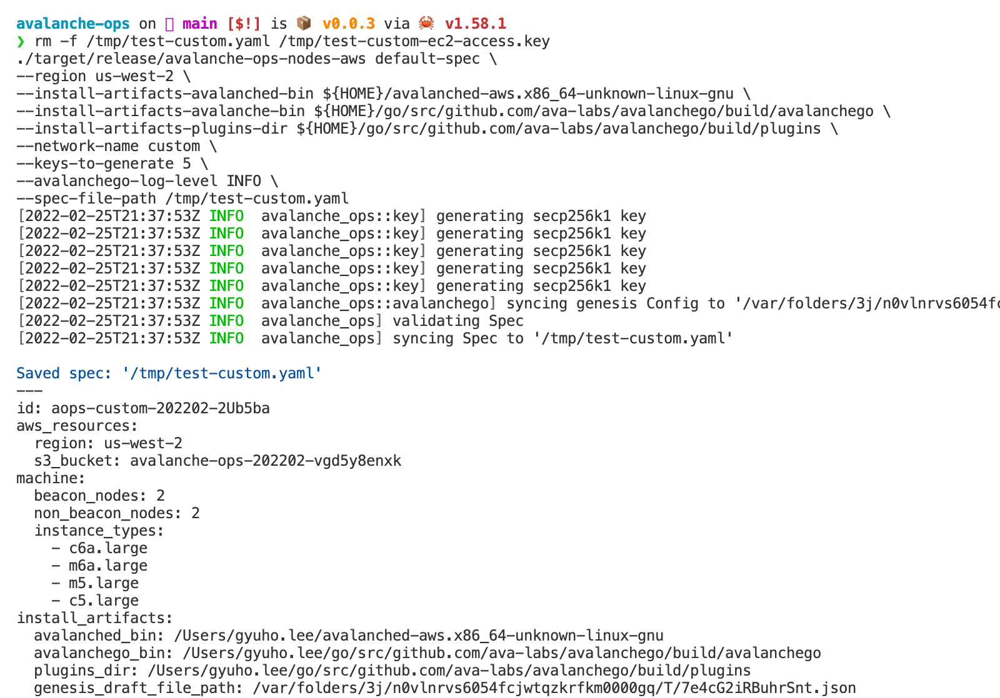
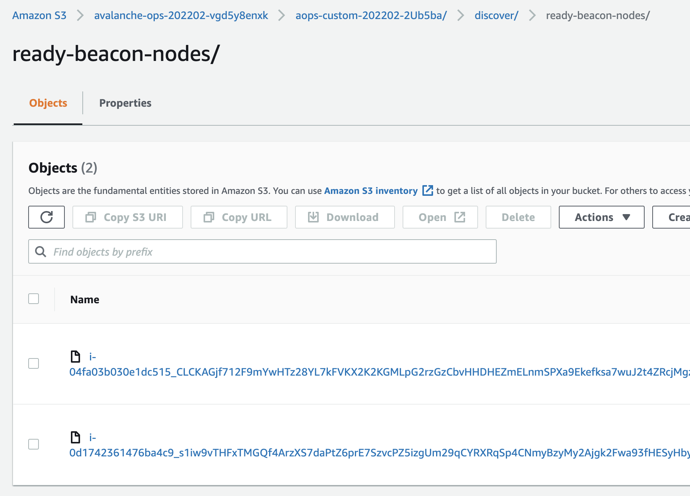
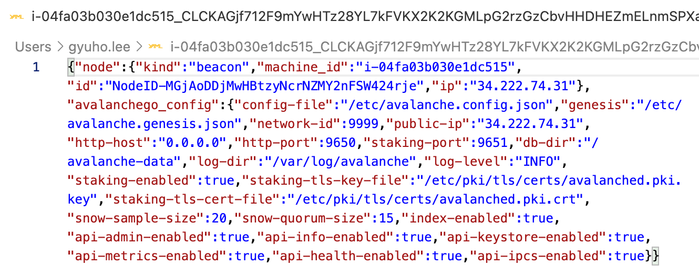
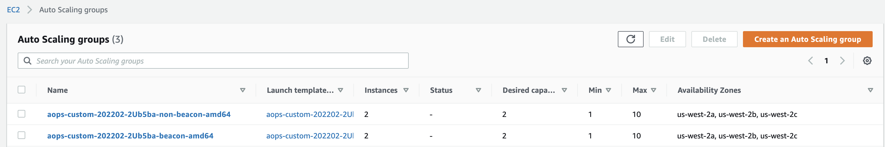
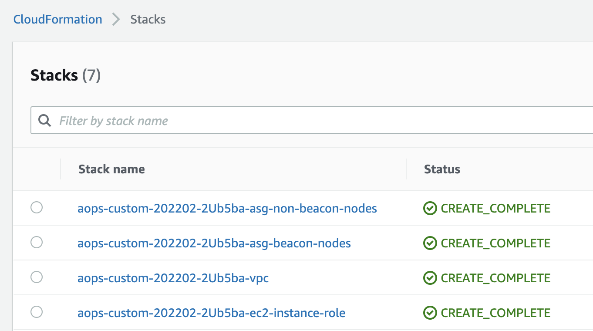
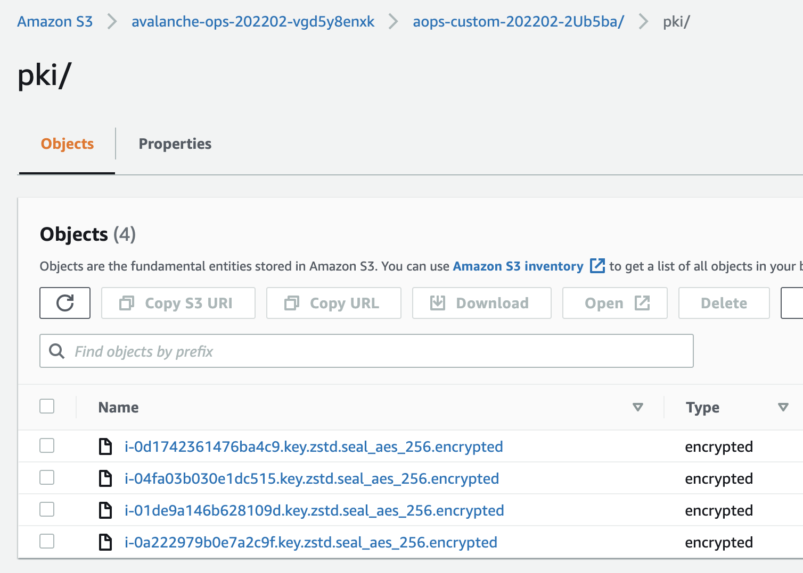
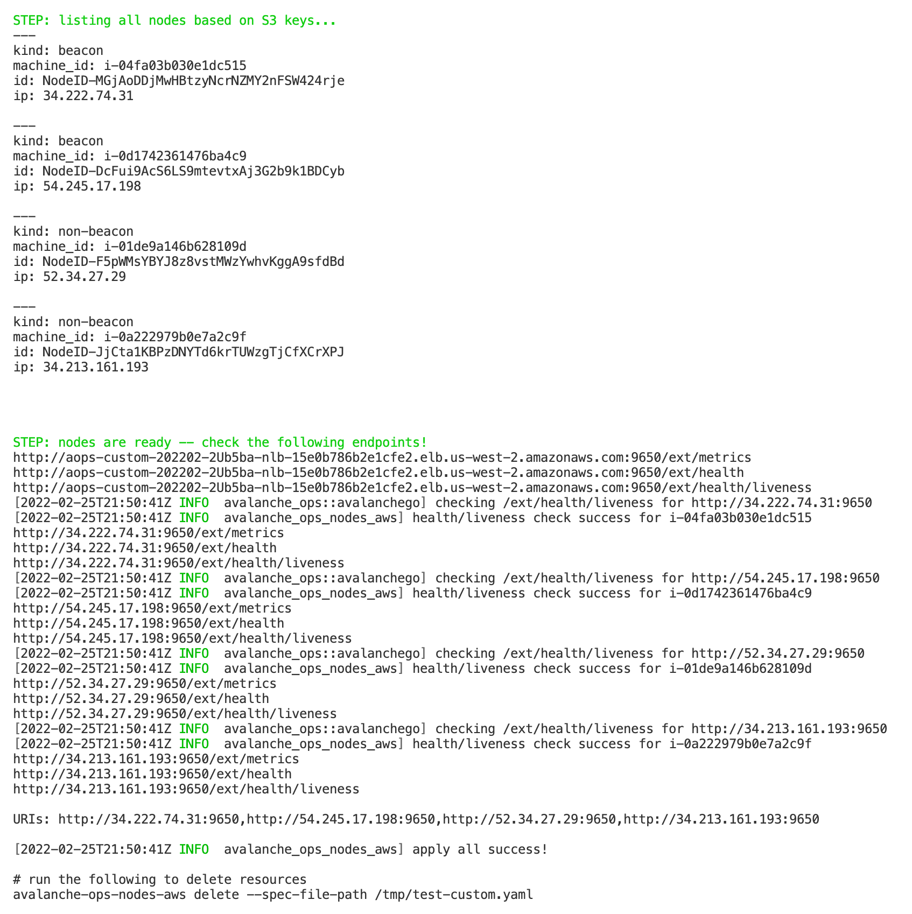
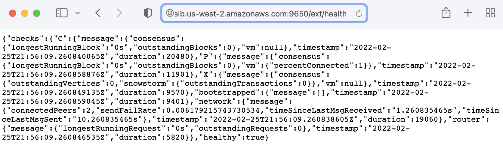

<br>

 

# Avalanche Ops

`avalanche-ops` is an operation toolkit for Avalanche nodes:
- 🦀 Written in Rust
- ✅ Fully automates VM (or physical machine) provisioning
- ✅ Fully automates node installation and operations
- ✅ Fully automates custom network setups
- ✅ Fully automates custom VM (subnet) setups
- 📨 Securely encrypt all artifacts in case of backups

`avalanche-ops` is:
- 🚫 NOT a replacement of [`avalanchego`](https://github.com/ava-labs/avalanchego)
- 🚫 NOT implementing any client-side load generation (to be done in Avalanche client/node projects)
- 🚫 NOT implementing any Avalanche-specific test cases (focus on infrastructure setups)
- 🚫 NOT using Kubernetes, prefers physical machines (or cloud VMs)
- 🚫 **NOT production ready** (under heavy development, only used for testing)

## Installation

```bash
# to build manually
./scripts/build.release.sh

# TODO: not working
# ./scripts/build.cross.sh
```

```bash
# to download from the github release page
# https://github.com/ava-labs/avalanche-ops/releases/tag/latest
curl -L \
https://github.com/ava-labs/avalanche-ops/releases/download/latest/avalanched-aws.x86_64-unknown-linux-gnu \
-o /tmp/avalanched-aws.x86_64-unknown-linux-gnu
```

It requires Avalanche node software in order to bootstrap the remote machines:

```bash
# https://github.com/ava-labs/avalanchego/releases
VERSION=1.7.5
DOWNLOAD_URL=https://github.com/ava-labs/avalanchego/releases/download/
rm -rf /tmp/avalanchego.tar.gz /tmp/avalanchego-v${VERSION}
curl -L ${DOWNLOAD_URL}/v${VERSION}/avalanchego-linux-amd64-v${VERSION}.tar.gz -o /tmp/avalanchego.tar.gz
tar xzvf /tmp/avalanchego.tar.gz -C /tmp
find /tmp/avalanchego-v${VERSION}
```

## Workflow

**`avalanche-ops`** is the client (or "control plane") that runs on the operator's host machine or test runner, which provisions a set of remote machines based on user-provided configuration. **`avalanched`** is an agent (or daemon) that runs on every remote machine, which creates and installs Avalanche-specific resources (e.g., TLS certificate generation, beacon-node discovery, write avalanche node service file).

First, provide **`avalanche-ops`** with genesis file and executable binaries to run in remote machines. Which then controls remote machines to download and set up such user-provided artifacts. Setting up a custom network requires two groups of machines: (1) beacon node (only required for custom network), and (2) non-beacon node. During the bootstrap phase, regardless of its node kind, **`avalanched`** auto-generates TLS certificates and stores them encrypted in the remote storage. Beacon nodes publish its information in YAML to the shared remote storage, and non-beacon nodes list the storage to discover beacon nodes.

## `avalanche-ops` on AWS

A single command to create a new Avalanche node from scratch and join any network of choice (e.g., test, fuji, main) or a custom Avalanche network with multiple nodes. Provisions all AWS resources required to run a node or network with recommended setups (configurable):

```bash
avalanche-ops-nodes-aws default-spec \
--install-artifacts-avalanched-bin /tmp/avalanched-aws.x86_64-unknown-linux-gnu \
--install-artifacts-avalanche-bin /tmp/avalanchego-v1.7.5/avalanchego \
--install-artifacts-plugins-dir /tmp/avalanchego-v1.7.5/plugins \
--install-artifacts-genesis-draft-file-path artifacts/sample.genesis.json \
--spec-file-path /tmp/test.yaml \
```

```bash
# make sure you have access to your AWS account
ROLE_ARN=$(aws sts get-caller-identity --query Arn --output text);
echo $ROLE_ARN

ACCOUNT_ID=$(aws sts get-caller-identity --query Account --output text);
echo ${ACCOUNT_ID}
```

```bash
# edit "/tmp/test.yaml" if needed
# to create resources
avalanche-ops-nodes-aws apply \
--spec-file-path /tmp/test.yaml
```

```bash
# to clean up resources
avalanche-ops-nodes-aws delete \
--spec-file-path /tmp/test.yaml

# specify "--delete-all" to delete auto-created S3 bucket,
# CloudWatch log groups, etc.
# otherwise, some resources won't be deleted
avalanche-ops-nodes-aws delete \
--spec-file-path /tmp/test.yaml \
--delete-all
```

## `avalanched` on AWS

Avalanche node daemon that provisions and manages the software on the remote machine (e.g., generate certs, encrypt, upload to S3):

```bash
avalanched-aws
```

### Example: set up custom network on AWS

Write the configuration file with some default values:




Then apply the configuration:


Wait for beacon nodes to be ready:


Check your S3 bucket for generated artifacts **(all keys are encrypted using KMS)**:







Check the beacon nodes:



Check non-beacon nodes created in a separate Auto Scaling Groups:




Check how non-beacon nodes discovered other beacon nodes and publish non-beacon nodes information:


Check logs from nodes are being published:



Now that the network is ready, check the metrics URL (or access via public IPv4 address):


To shut down the network, run `avalanche-ops-nodes-aws delete` command:






## Roadmap

- Genesis file generator with pre-funded wallets
- Failure injection testing
- Stress testing
- Metrics collection
- Support custom VMs
- Support ARM
- Support Raspberry Pi
- Support key rotation

## Other projects

- [`avalanche-network-runner`](https://github.com/ava-labs/avalanche-network-runner) to run a local network (with Kubernetes)
- [`avalanchego-operator`](https://github.com/ava-labs/avalanchego-operator) to run a Kubernetes operator
