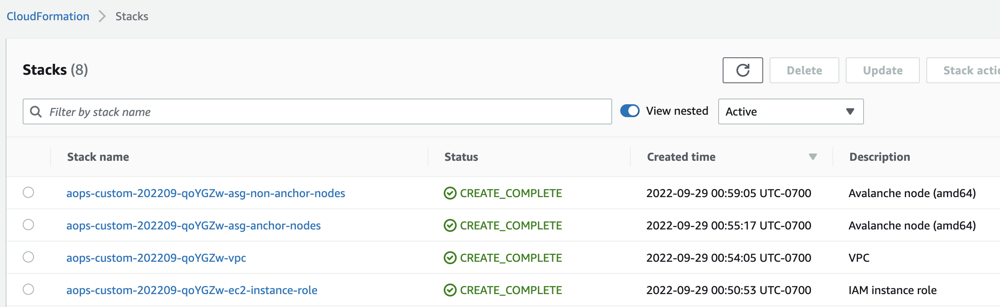
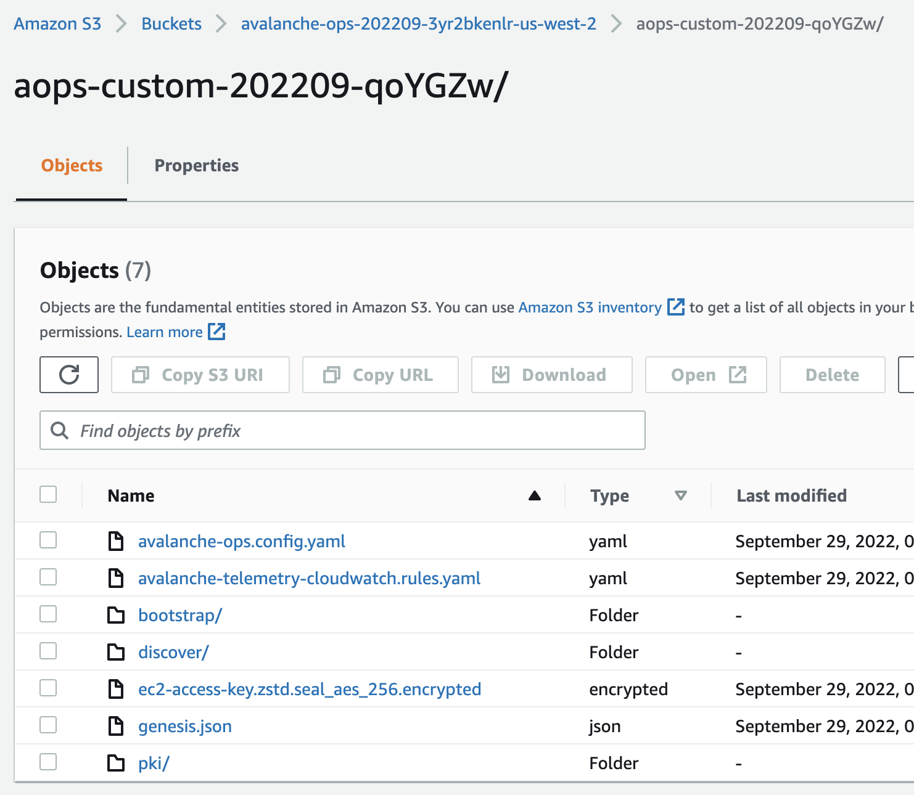
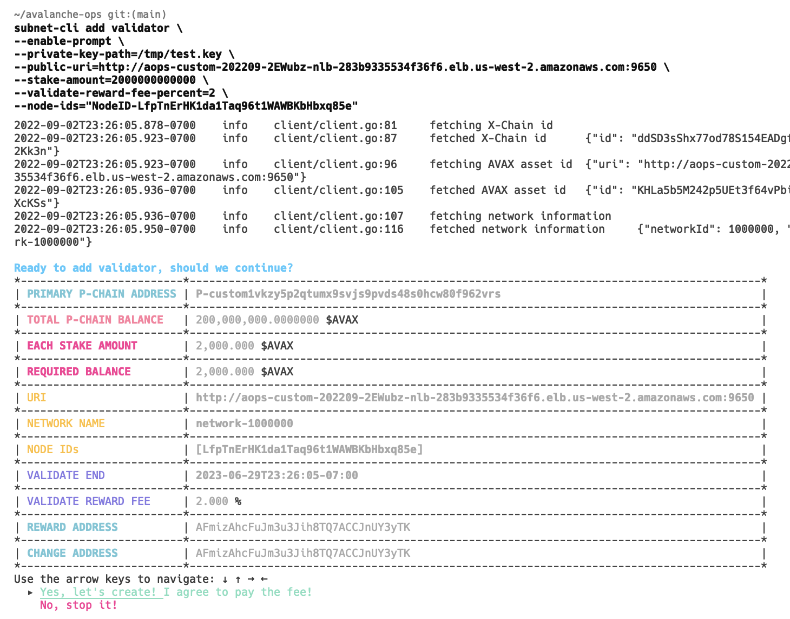
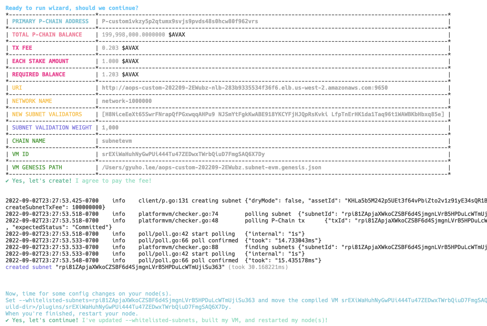
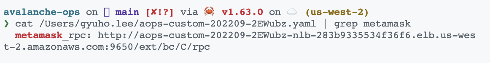
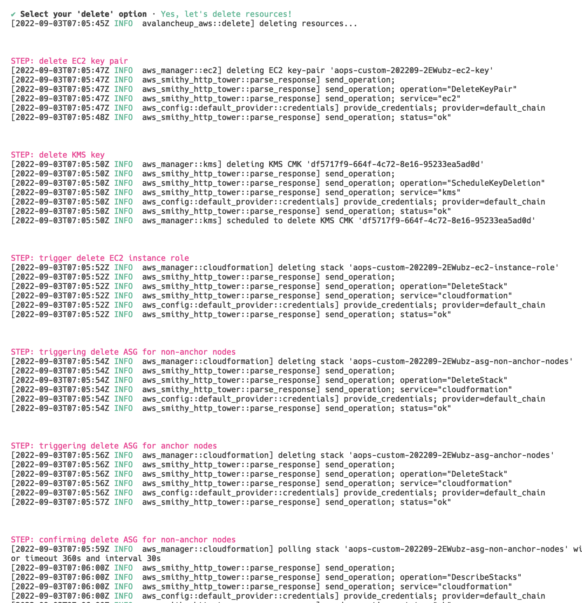

## Example: set up custom network on AWS

*See ["Custom network with NO initial database state, with subnet-evm"](recipes-aws.md#custom-network-with-no-initial-database-state-with-subnet-evm) for the full commands.*

Write the configuration file with some default values:

Then apply the configuration:

Wait for anchor nodes to be ready:

Check your S3 bucket for generated artifacts **(all private keys are encrypted using KMS/envelope encryption)**:

Check the anchor nodes:

Check non-anchor nodes created in a separate Auto Scaling Groups:

Check how non-anchor nodes discovered other anchor nodes and publish non-anchor nodes information:

Check logs and metrics from nodes are being published:

Now that the network is ready, check the metrics and health URL (or access via public IPv4 address):

Now the custom network is ready! Check out the genesis file:

To interact with C-chain via MetaMask, add the DNS RPC endpoint as a custom network as follows:

Or use [Core wallet](https://chrome.google.com/webstore/detail/core/agoakfejjabomempkjlepdflaleeobhb):

Import the test keys for pre-funded wallets:

### Optional: install `subnet-evm` in the custom network

To set up [`subnet-evm`](https://github.com/ava-labs/subnet-evm), use [`subnet-cli`](https://github.com/ava-labs/subnet-cli) to add two non-anchor nodes as validators:

To create a custom blockchain for `subnet-evm`:

Restart the nodes with the tracked subnet ID as instructed **(this will be automated in future `avalanche-ops` releases)**:

To add `subnet-evm` network to MetaMask, use the newly created blockchain ID for RPC endpoints:

Note that the existing test keys are pre-funded (as in C-chain):

To look at the `subnet-vm` logs:

To shut down the network, run `avalancheup-aws delete` command:

