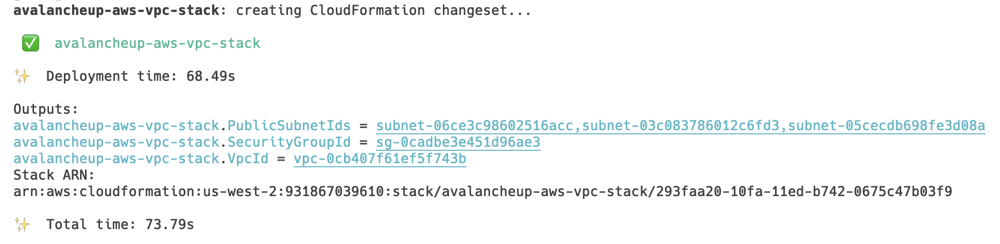

# Welcome to your CDK TypeScript project

This is a blank project for CDK development with TypeScript.

The `cdk.json` file tells the CDK Toolkit how to execute your app.

## Useful commands

* `npm run build`   compile typescript to js
* `npm run watch`   watch for changes and compile
* `npm run test`    perform the jest unit tests
* `cdk deploy`      deploy this stack to your default AWS account/region
* `cdk diff`        compare deployed stack with current state
* `cdk synth`       emits the synthesized CloudFormation template

## Examples

NOTES
- Runs `avalanched` lite mode
- `avalanched` envelope-encrypts the generated node certificate, so nobody else has access to the certificate
- Runs `aws-volume-provisioner` to reuse EBS volumes https://github.com/ava-labs/volume-manager
- Need manual EBS volume cleanups

### Step 1. Clone 

```bash
cd ${HOME}
git clone https://github.com/ava-labs/avalanche-ops.git
cd ./avalanche-ops
```

### Step 2. Create S3 bucket for backing up envelope-encrypted node certificate

*NOTE: Replace `S3_BUCKET_NAME` with your own S3 bucket name:*

```bash
# e.g.,
S3_BUCKET_NAME=avalancheup-aws-test-bucket-with-cdk

aws s3api \
create-bucket \
--bucket ${S3_BUCKET_NAME} \
--region us-west-2 \
--create-bucket-configuration LocationConstraint=us-west-2

aws s3 ls s3://${S3_BUCKET_NAME}/
```

### Step 3. Create KMS key for envelope-encrypting the node certificate

*NOTE: Replace `KMS_CMK_ARN` with your own KMS key:*

```bash
KMS_CMK_ARN=$(aws kms --region us-west-2 create-key --query KeyMetadata.Arn --output text)
echo ${KMS_CMK_ARN}

# e.g.,
KMS_CMK_ARN=arn:aws:kms:us-west-2:931867039610:key/c5a7894a-ddd8-4b67-8c98-081d053bc4e9
aws kms describe-key --region us-west-2 --key-id ${KMS_CMK_ARN} --query KeyMetadata.Arn --output text

# e.g.,
# arn:aws:kms:us-west-2:931867039610:key/c5a7894a-ddd8-4b67-8c98-081d053bc4e9
```

To delete the key later:

```bash
# e.g.,
KMS_CMK_ARN=arn:aws:kms:us-west-2:931867039610:key/c5a7894a-ddd8-4b67-8c98-081d053bc4e9

# to delete
aws kms schedule-key-deletion \
--region us-west-2 \
--key-id ${KMS_CMK_ARN} \
--pending-window-in-days 7
aws kms describe-key --key-id ${KMS_CMK_ARN}
```

### Step 4. Create EC2 key pair for SSH access to the nodes

*NOTE: Replace `EC2_KEY_PAIR_NAME` with your own EC2 key pair name:*

```bash
# e.g.,
EC2_KEY_PAIR_NAME=avalancheup-aws-test-ec2-key-with-cdk

aws ec2 create-key-pair --region us-west-2 --key-name ${EC2_KEY_PAIR_NAME}
aws ec2 describe-key-pairs --region us-west-2 --key-name ${EC2_KEY_PAIR_NAME}
```

```bash
# e.g.,
EC2_KEY_PAIR_NAME=avalancheup-aws-test-ec2-key-with-cdk

# to delete
aws ec2 delete-key-pair --region us-west-2 --key-name ${EC2_KEY_PAIR_NAME}
```

### Step 5. Create EC2 instance role for Avalanche node

Make sure `cdk` is installed:

```bash
cdk --version
```

*Set the following parameters:*

- `CDK_REGION`: AWS region to create resources
- `CDK_ACCOUNT`: AWS account to create resources
- `ID`: Unique identifier for the node
- `KMS_CMK_ARN`: AWS CMK ARN for envelope-encryption of your node certificate
- `S3_BUCKET_NAME`: S3 bucket name to back up the node certificate

For example:

```bash
cd ${HOME}/avalanche-ops/cdk/avalancheup-aws

CDK_REGION=us-west-2 \
CDK_ACCOUNT=931867039610 \
ID=my-cluster-id \
KMS_CMK_ARN=arn:aws:kms:us-west-2:931867039610:key/c5a7894a-ddd8-4b67-8c98-081d053bc4e9 \
S3_BUCKET_NAME=avalancheup-aws-test-bucket-with-cdk \
npx cdk deploy avalancheup-aws-instance-role-stack
```


See [`ec2_instance_role.yaml`](../../avalanche-ops/src/aws/cfn-templates/ec2_instance_role.yaml) for the CloudFormation template.

### Step 6. Create VPC for Avalanche node

*Set the following parameters:*

- `CDK_REGION`: AWS region to create resources
- `CDK_ACCOUNT`: AWS account to create resources
- `ID`: Unique identifier for the node

For example:

```bash
cd ${HOME}/avalanche-ops/cdk/avalancheup-aws

CDK_REGION=us-west-2 \
CDK_ACCOUNT=931867039610 \
ID=my-cluster-id \
npx cdk deploy avalancheup-aws-vpc-stack
```




Example outputs are:

```
avalancheup-aws-vpc-stack.PublicSubnetId1Az = us-west-2a
avalancheup-aws-vpc-stack.PublicSubnetId2Az = us-west-2b
avalancheup-aws-vpc-stack.PublicSubnetId3Az = us-west-2c
avalancheup-aws-vpc-stack.PublicSubnetIds = subnet-05cabd5919ddc9777,subnet-0e9cd3f506f6dab12,subnet-0c3cc61411281e077
avalancheup-aws-vpc-stack.SecurityGroupId = sg-04a4ec189b8057781
avalancheup-aws-vpc-stack.VpcId = vpc-0a4e93c82440759d0
```

See [`vpc.yaml`](../../avalanche-ops/src/aws/cfn-templates/vpc.yaml) for the CloudFormation template.

### Step 7. Create EC2 autoscaling group for Avalanche node

*Set the following parameters:*

- `CDK_REGION`: AWS region to create resources
- `CDK_ACCOUNT`: AWS account to create resources
- `ID`: Unique identifier for the node
- `KMS_CMK_ARN`: AWS CMK ARN for envelope-encryption of your node certificate
- `S3_BUCKET_NAME`: S3 bucket name to back up the node certificate
- `EC2_KEY_PAIR_NAME`: EC2 key pair name for SSH access
- `AAD_TAG`: Authentication of additional authenticated data (AAD) for envelope-encryption
- `INSTANCE_PROFILE_ARN`: EC2 instance profile ARN created above
- `SECURITY_GROUP_ID`: VPC security group
- `PUBLIC_SUBNET_IDS`: public subnet IDs created above VPC
- `NETWORK_ID`: network ID, 1 for mainnet, 5 for fuji/test net
- `NLB_VPC_ID`: VPC ID, used for setting up NLB

For example:

```bash
cd ${HOME}/avalanche-ops/cdk/avalancheup-aws

PUBLIC_SUBNET_IDS='subnet-05cabd5919ddc9777,subnet-0e9cd3f506f6dab12,subnet-0c3cc61411281e077' \
CDK_REGION=us-west-2 \
CDK_ACCOUNT=931867039610 \
ID=my-cluster-id \
KMS_CMK_ARN=arn:aws:kms:us-west-2:931867039610:key/c5a7894a-ddd8-4b67-8c98-081d053bc4e9 \
S3_BUCKET_NAME=avalancheup-aws-test-bucket-with-cdk \
EC2_KEY_PAIR_NAME=avalancheup-aws-test-ec2-key-with-cdk \
AAD_TAG=my-add-tag \
INSTANCE_PROFILE_ARN=arn:aws:iam::931867039610:instance-profile/my-cluster-id-instance-profile \
SECURITY_GROUP_ID=sg-04a4ec189b8057781 \
NETWORK_ID=5 \
NLB_VPC_ID=vpc-0a4e93c82440759d0 \
npx cdk deploy avalancheup-aws-asg-stack
```


See [`asg_ubuntu.yaml`](../../avalanche-ops/src/aws/cfn-templates/asg_ubuntu.yaml) for the CloudFormation template.

### Step 8. Check the created resources

Use `NlbDnsName` output from the stack above to check the metrics and RPC endpoints. For instance, `http:// + NlbDnsName + :9650/ext/metrics` returns the current metrics of the node:


And go to CloudWatch Logs to see the logs being published from the `avalanched`:


And go to CloudWatch Metrics to see the metrics being published from the `avalanched`:


And go to S3 bucket to see the node certificate being published from the `avalanched`.

```bash
# run the following command to download and decrypt the node certificate from S3 bucket
#
# optional
# e.g.,
./scripts/build.release.sh
./target/release/staking-key-cert-s3-downloader \
--log-level=info \
--aws-region=us-west-2 \
--s3-bucket=avalanche-ops-202207-3cq76s4cie \
--s3-key-tls-key=aops-fuji-202207-23XhJA/pki/NodeID-KsGs96iZYWHS9bNwA47VKPmkNBVUKRFsD.key.zstd.encrypted \
--s3-key-tls-cert=aops-fuji-202207-23XhJA/pki/NodeID-KsGs96iZYWHS9bNwA47VKPmkNBVUKRFsD.crt.zstd.encrypted \
--kms-cmk-id=87c771e3-6166-414b-b46e-5f4845e57a3c \
--aad-tag='avalanche-ops-aad-tag' \
--tls-key-path=/tmp/NodeID-KsGs96iZYWHS9bNwA47VKPmkNBVUKRFsD.key \
--tls-cert-path=/tmp/NodeID-KsGs96iZYWHS9bNwA47VKPmkNBVUKRFsD.cr
```

### (Optional) Step 9. Delete the created resources

Run `cdk destroy` for each stack as follows:

```bash
cd ${HOME}/avalanche-ops/cdk/avalancheup-aws
CDK_REGION=us-west-2 \
CDK_ACCOUNT=931867039610 \
cdk destroy avalancheup-aws-asg-stack

cd ${HOME}/avalanche-ops/cdk/avalancheup-aws
CDK_REGION=us-west-2 \
CDK_ACCOUNT=931867039610 \
cdk destroy avalancheup-aws-vpc-stack

cd ${HOME}/avalanche-ops/cdk/avalancheup-aws
CDK_REGION=us-west-2 \
CDK_ACCOUNT=931867039610 \
cdk destroy avalancheup-aws-instance-role-stack
```

## Alternatives

If you are looking for a Rust-based CLI, please check out [`avalancheup-aws/recipes`](https://github.com/ava-labs/avalanche-ops/blob/main/avalancheup-aws/recipes-aws.md).
