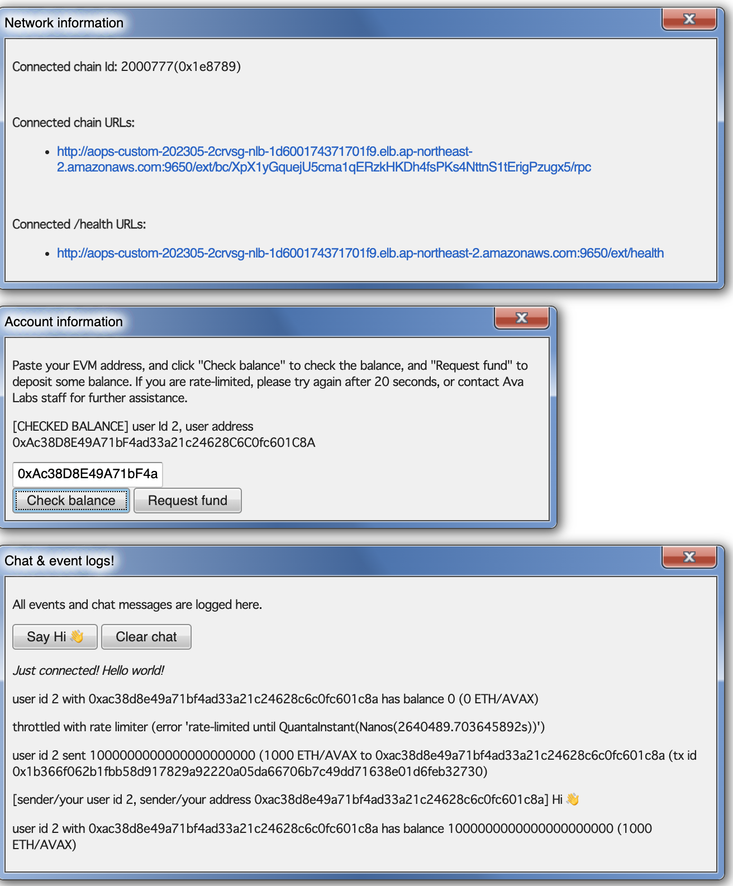

# Gassless vote counter example



## Running

```bash
cargo build \
--release \
--bin devnet-faucet
```

```bash
./target/release/devnet-faucet -h
```

And deploy the test voter contract:

```bash
cd ${HOME}/transaction-manager
forge create \
--gas-price 700000000000 \
--priority-gas-price 10000000000 \
--private-key=56289e99c94b6912bfc12adc093c9b51124f0dc54ac7a766b2bc5ccf558d8027 \
--rpc-url=http://52.79.179.81:9650/ext/bc/AUAqCbsYensWb461N4AMDegjxDQoEAUSgW1h7FfH8cdVpcvHv/rpc \
contracts/voter/Voter.sol:Voter \
--constructor-args 0x52C84043CD9c865236f11d9Fc9F56aa003c1f922
```

For example,

```bash
# remove "--dry-mode" to talk to chain and rpc servers
./target/release/devnet-faucet \
--log-level=info \
--http-host=0.0.0.0:3030 \
--dry-mode \
--chain-rpc-urls=http://54.203.103.179:9650/ext/bc/MZ7nxZbHBDFzTboS1rn94KuJZBuftNfAPYR7LvYe3HQM3wvAE/rpc,http://100.20.211.207:9650/ext/bc/MZ7nxZbHBDFzTboS1rn94KuJZBuftNfAPYR7LvYe3HQM3wvAE/rpc,http://44.228.65.174:9650/ext/bc/MZ7nxZbHBDFzTboS1rn94KuJZBuftNfAPYR7LvYe3HQM3wvAE/rpc,http://35.85.173.22:9650/ext/bc/MZ7nxZbHBDFzTboS1rn94KuJZBuftNfAPYR7LvYe3HQM3wvAE/rpc,http://100.21.9.113:9650/ext/bc/MZ7nxZbHBDFzTboS1rn94KuJZBuftNfAPYR7LvYe3HQM3wvAE/rpc \
--relayer-rpc-urls=http://54.69.15.146:9876/rpc,http://52.25.134.102:9876/rpc,http://52.41.248.38:9876/rpc,http://44.237.192.191:9876/rpc,http://35.80.220.99:9876/rpc \
--trusted-forwarder-contract-address=0x52C84043CD9c865236f11d9Fc9F56aa003c1f922 \
--domain-name='my domain name' \
--domain-version='my domain version' \
--type-name='my type name' \
--type-suffix-data='bytes8 typeSuffixDatadatadatada)' \
--voter-contract-address=0x5DB9A7629912EBF95876228C24A848de0bfB43A9
```

And open http://0.0.0.0:3030
