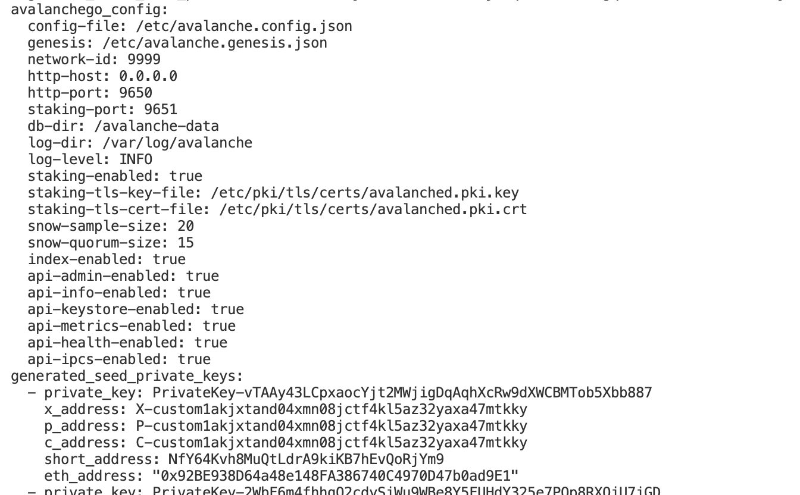
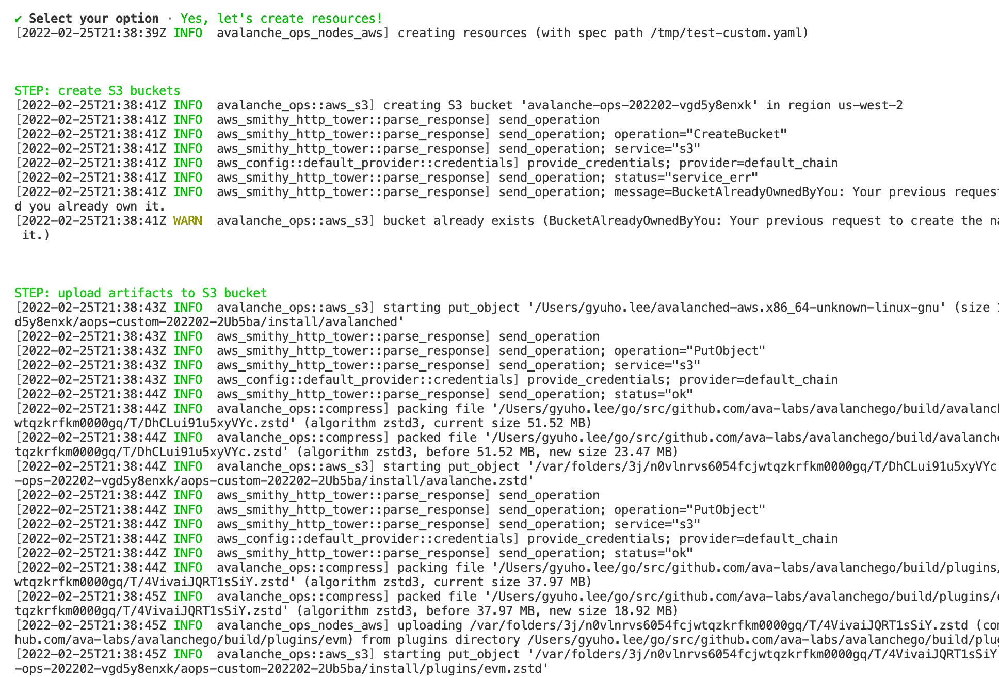
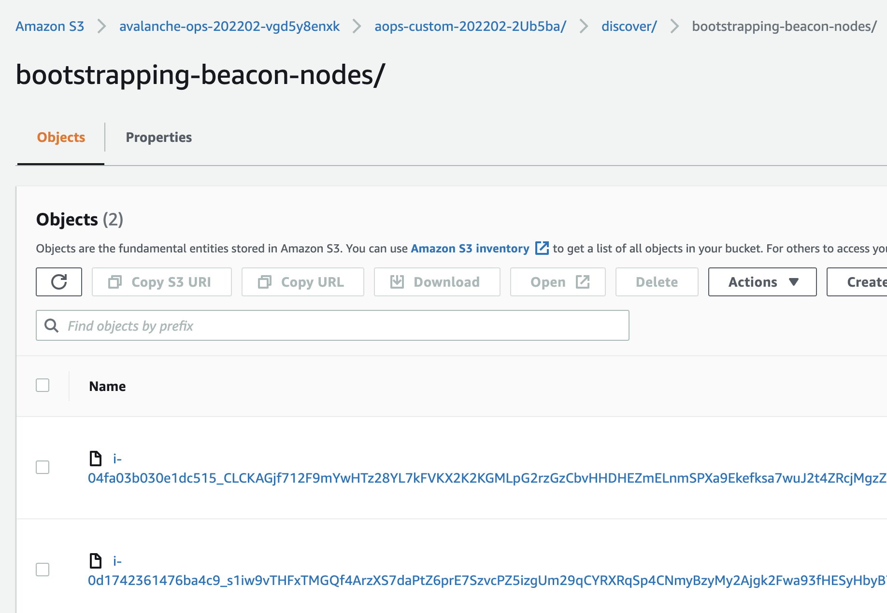
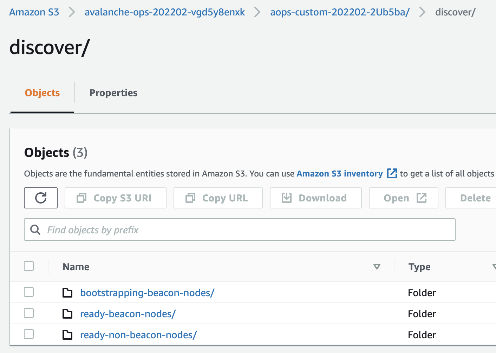
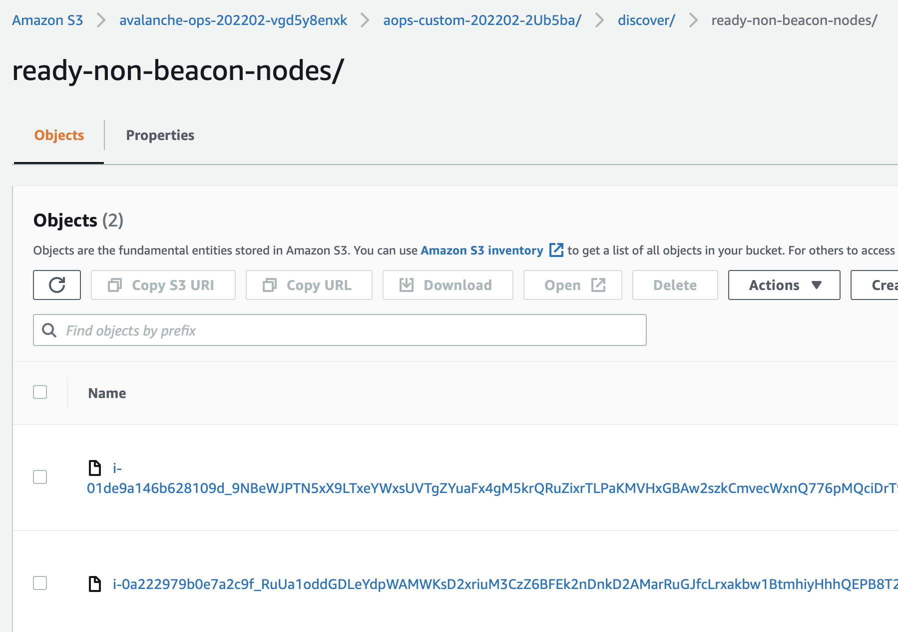
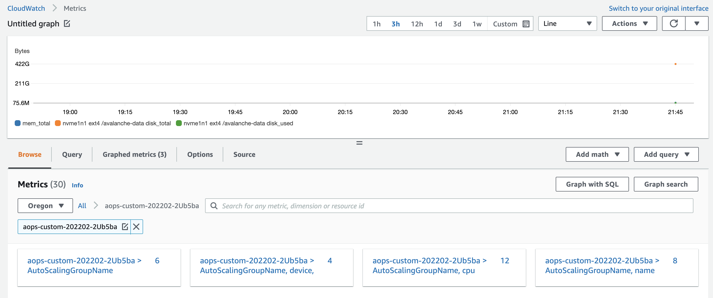
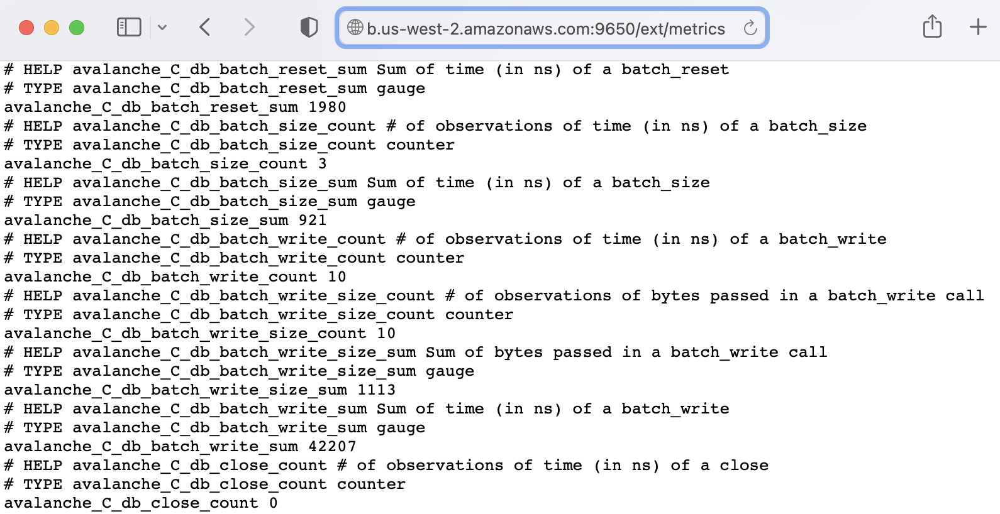
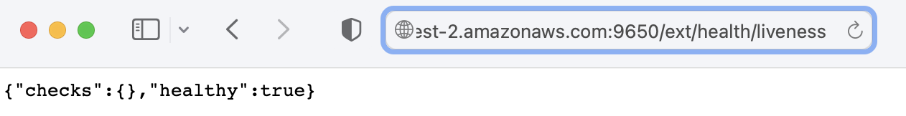
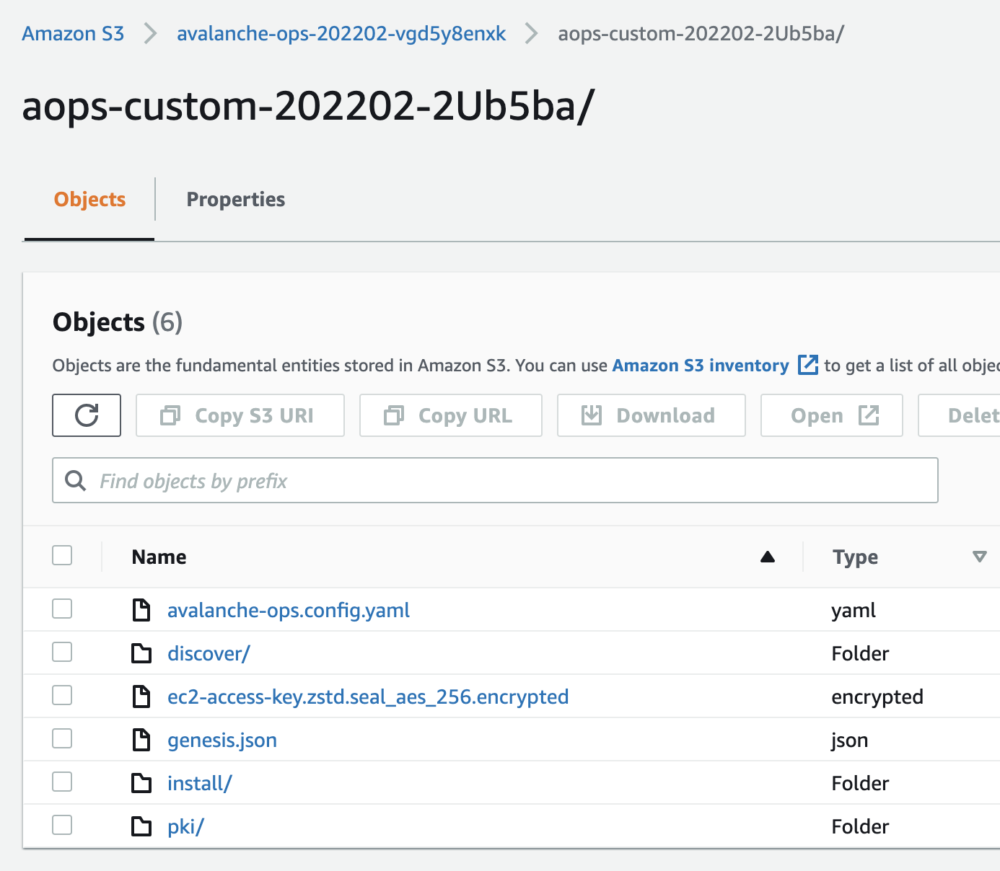
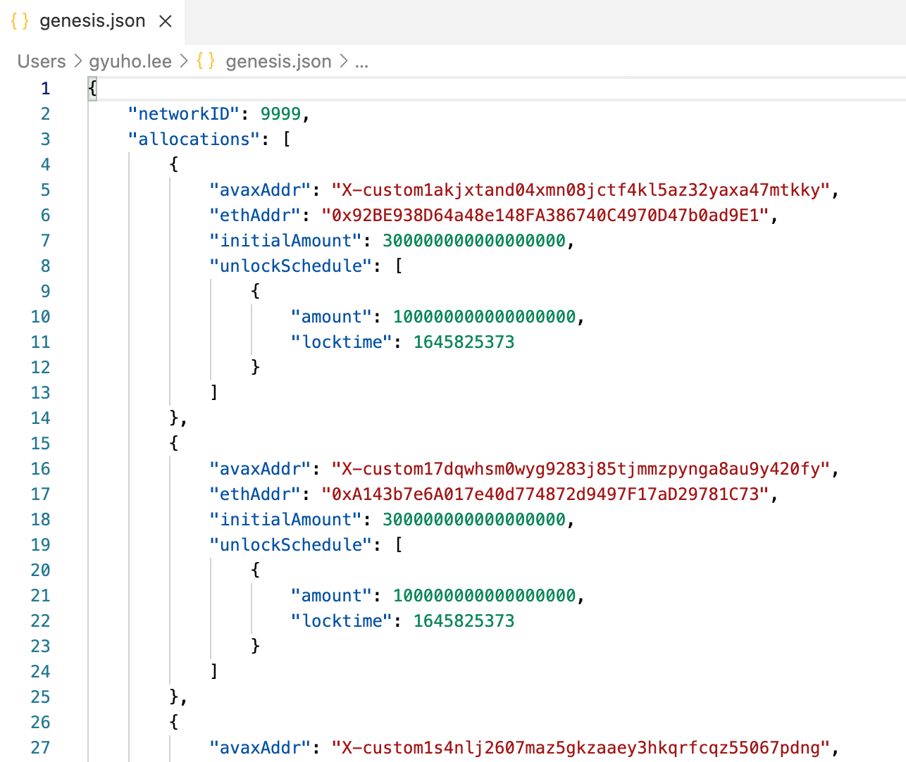

### Example: set up custom network on AWS

Write the configuration file with some default values:

Then apply the configuration:

Wait for beacon nodes to be ready:

Check your S3 bucket for generated artifacts **(all keys are encrypted using KMS)**:

Check the beacon nodes:

Check non-beacon nodes created in a separate Auto Scaling Groups:

Check how non-beacon nodes discovered other beacon nodes and publish non-beacon nodes information:

Check logs from nodes are being published:

Now that the network is ready, check the metrics and health URL (or access via public IPv4 address):

Now the custom network is ready! Check out the genesis file for pre-funded keys:

To shut down the network, run `avalanche-ops-nodes-aws delete` command:

